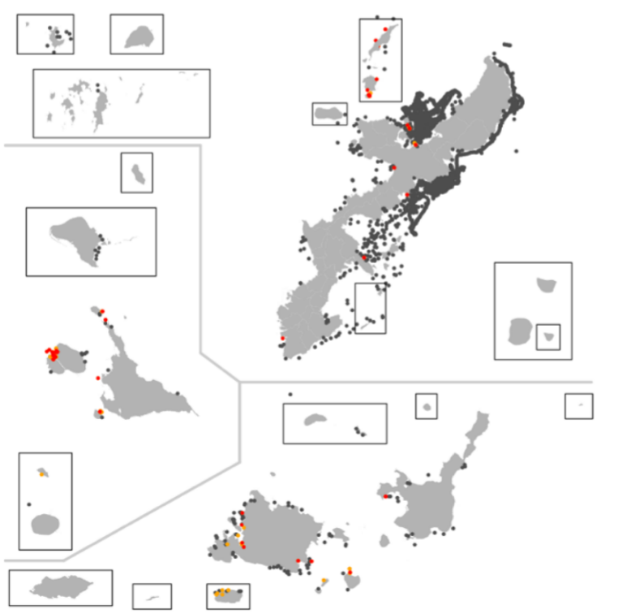
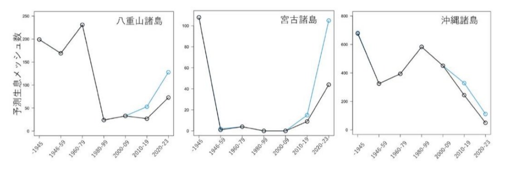

# 久米島でジュゴンが確認！
## 琉球諸島の沿岸海域におけるジュゴン個体群再生の展望

先日4月29日に、久米島の近海で、ジュゴンの写真が撮影されました。

[琉球新報の記事はこちら](https://ryukyushimpo.jp/news/national/entry-4198815.html)

私たちシンク・ネイチャーでは、沖縄県や関連研究者と連携しつつ、琉球諸島における「ジュゴンの見える化」を推進し、ジュゴン個体群の保全再生計画を提案し続けています。そこで、今回の久米島におけるジュゴンの確認が意味することを、最新のデータ分析結果をもとに解説したいと思います。

---

### 問題意識

日本産のジュゴン個体群を保全再生するには、沖縄県近海のジュゴン分布の実態と、個体数を把握することが重要です。

そこで、私たちは、ジュゴンの分布を明示する喰み跡や糞の目撃情報（専門家による十分な精度検証を経た信頼できるデータ）と、機械学習による種分布モデリングを用いて、ジュゴンの分布と生息適地を可視化しています。さらに、ジュゴンの繁殖動向を把握するために、2010年以降の目撃情報の中から、ジュゴンの母子と考えられる情報を抽出し、沖縄県に生息するジュゴンの最小個体数を推論しています。

---

### ジュゴン見える化の結果

以下の地図は、沖縄県内のジュゴンの目撃情報で、赤色丸と黄色丸は、2020年以後の目撃・痕跡地点で、灰色丸は2019年までの目撃地点を示しています。

ジュゴンの分布が観察されたポイントに、その場所の水深、海水温、海水塩分量、藻場面積、護岸、海岸線距離など27個の自然環境データを紐付けて、学習データを整備します。

これを基に、ジュゴンの種分布を予測するためのAIモデルを開発しました。この「ジュゴン見える化AIモデル」の種分布予測の精度は、これまでの私たちの生物多様性可視化研究において、正答率80～90%であることが確認されています。

---

### ジュゴンの生息分布の変遷

このモデルを用いて、年代ごとのジュゴンの生息分布を推定して、時代に伴うジュゴンの分布エリアを計算しました。以下の地図は、ジュゴンの生息推定エリアを、次の年代区分で可視化した結果です。

- 1945年以前  

- 1946–1959年  

- 1960–1979年  

- 1980–1999年  

- 2000–2009年  

- 2010–2019年  

- 2020–2022年  

---

### 時代別の分布面積の推移

以上の時代変遷によるジュゴン分布エリアの可視化結果を基に、ジュゴンが生息する海域メッシュを定量してみました。

以下のグラフは、横軸は年代で、縦軸はジュゴンの分布面積に相当する生息メッシュ数です。

このグラフから、1945年以前の過去から現在にかけて、ジュゴンの分布エリアは減少してきたことが明らかです。

しかし、2000年代以降、八重山諸島や宮古諸島でジュゴンの分布エリアが底打ちして、回復する傾向が把握できます。

---

### 調査努力と分布評価

ちなみに、青色で示した折れ線グラフは、近年の調査で明らかになったジュゴンの分布データを加えた分析結果を示しています。つまり、調査努力を重ねると、ジュゴンの分布エリアが大きくなることが明らかで、従来的な調査不足がジュゴン分布を過小評価していたことも理解できます。

---

### 広域分布と回復の可能性

この分析結果からは、沖縄県のほぼ全域にジュゴンが広域的に存在することが明らかで、琉球諸島の南西部から、ジュゴン分布が再生しつつあることがわかります。

このことは、沖縄のジュゴンは孤立した個体群ではなく、フィリピンなどの個体群と黒潮を介して連結した個体群であることが示唆されます。実際、フィリピンには数百頭以上のジュゴンが生息していることが示唆されており（Marsh et al., 2002）、さらにジュゴンの移動は600km程度（Sheppard et al., 2006）、まれに1000km以上に及ぶことが指摘されています（Hobbs et al., 2007）。

---

### 保全の方向性

これら既存研究と本分析結果から、沖縄のジュゴン個体群は、沿岸海域の生息環境が保持・再生されれば、今後も十分に回復する可能性があると思われます。

実際、沖縄県内におけるジュゴンの母子個体が確認された地点は、種分布モデルで予想された生息適地適性度の高い海域に偏っていることも確認でき、海草藻場など健全な生息環境の保全が、ジュゴン個体群の再生産にとって重要であることも確認できています。

移入や繁殖で増加しつつあるジュゴン個体の「受け皿」となる生息適地を適切に保全再生するアクションが求められます。
